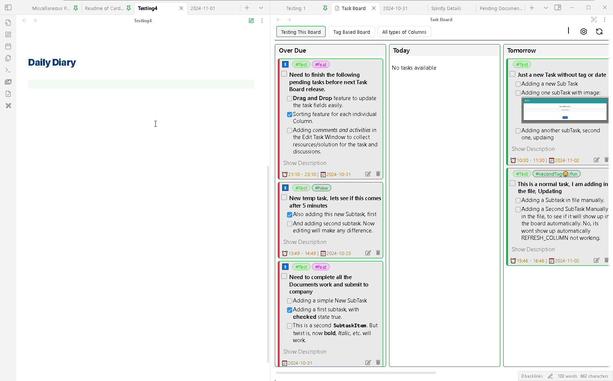

# Auto Scanning Feature

This feature helps you to detect the files you have modified and then scan them automatically to extract any new added task or the old task which you have edited.

This feature can be used two way, which can be controlled using the settings option : [Real-time scanning](../How_To/HowToUseGlobalSettings.md#real-time-scanning).

## Real Time Scanning

This is an powerful feature of Task Board which helps you to get the latest information of your vault tasks inside the Board. The plugin uses optimized way to scan the modified files and show the edited task content on the board.

Even though it says Real-Time, its not exactly real-time in the actual sense, because if you are editing any task, you focus will be on the file and when you will be changing your focus from the current edited to the [Task Board View](docs/Components/Task_Board_Pane.md), only that time you would be like to see your task date getting updated with the new changes. This same idea has been used to design this feature, wherein, after you move your focus from the edited file to any other tab or even out of the Obsidian application, you data will get refreshed in the Task Board View.

This is the default behavior of this plugin and its the best approach for scanning the changes in your vault and updating them on the board in real-time with the least amount of operations and consumption of energy.

A demo can be seen in the below GIF image :

But in-case, if you like to keep everything manual and have control over the scanning part. You can use the below method.

## Manual Scanning

If you like to scan the updated file manually and only refresh the board when you want. Then you can turn OFF the [Real-time scanning](../How_To/HowToUseGlobalSettings.md#real-time-scanning) settings option.

Once, you have turned the option OFF, your modified files wont be scanned after you loose focus from the file you have edited or saved. To scan all your updated files, you can go on the Task Board and press the `Refresh` button. This button will scan all the files which you have edited recently and update the changes inside the board.
